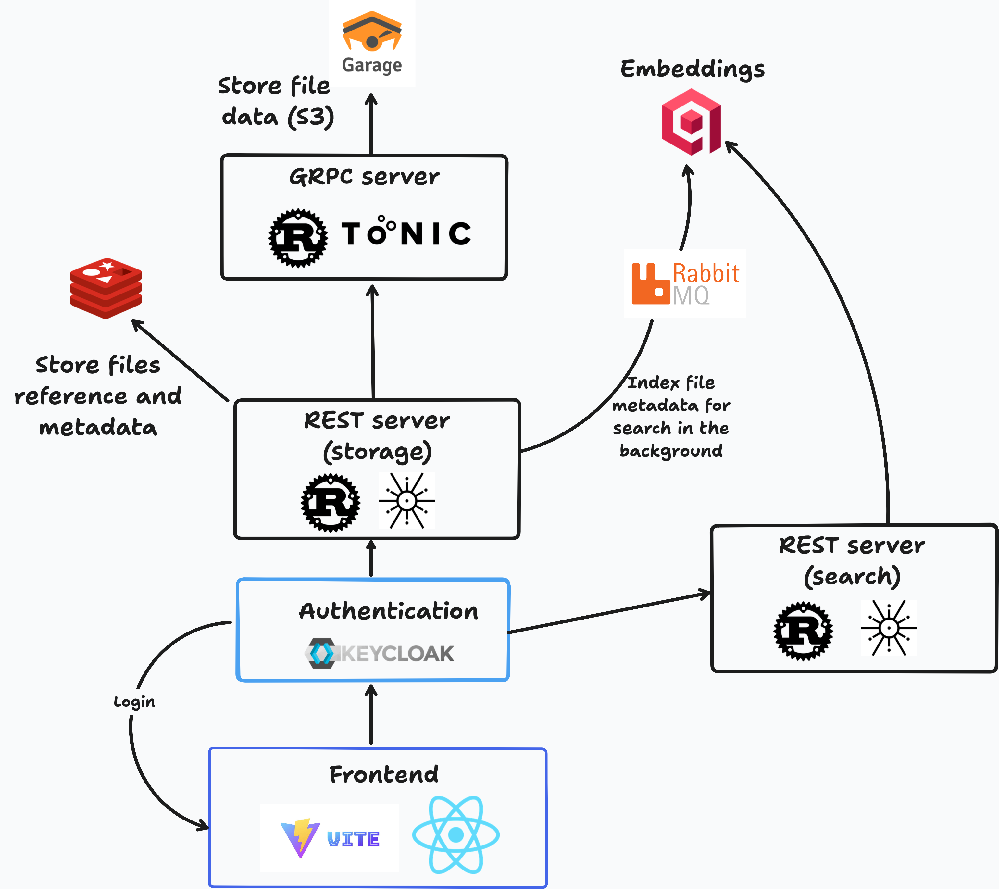

# File Storage

Self-hostable file storage platform built on a modern open-source stack.

## Architecture Overview

- **Frontend:** Vite + React app. Handles authentication via Keycloak, interacts with backend REST APIs, and provides file upload/search UI.
- **Backend (Rust):**
  - **REST Server:** Handles CRUD for file uploads, verifies auth tokens (Keycloak), stores file refs in Redis, rate-limits via Memcached, and enqueues metadata to RabbitMQ.
  - **gRPC Server:** Interfaces with Garage (S3-compatible) for file storage, presigned URLs, and deletion.
  - **Queue Worker:** Consumes RabbitMQ jobs, processes and indexes document metadata into Qdrant for search.
  - **Qdrant REST Server:** Exposes search APIs over indexed metadata.
- **Infrastructure:** All services are orchestrated via Docker Compose.
  - **Keycloak + Postgres:** Auth and user management.
  - **Garage:** S3-compatible object storage.
  - **Redis:** Stores file references.
  - **Memcached:** Rate limiting.
  - **RabbitMQ:** Job queue for async processing.
  - **Qdrant:** Vector DB for semantic search.
  - **Jaeger**: OTel traces export and exploration



### Security

- All backend endpoints require a valid Keycloak JWT.
- The frontend obtains and passes the token for every operation.

## Running with Docker

1. **Clone the repository:**
   ```sh
   git clone https://github.com/AstraBert/file-storage.git
   cd file-storage
   ```
2. **Set environment variables:**
   Copy or create a `.env` file with the required secrets (see `compose.yaml` for needed variables like `KEYCLOAK_ADMIN`, `POSTGRES_PASSWORD`, etc).
3. **Set up Keycloak realm and client:**
   - Follow the [Keycloak setup instructions](https://www.keycloak.org/docs/latest/server_admin/#user-registration) to create a `file-storage` realm and a `file-storage-frontend` client (it is recommended to leave default settings for users if there are no special requirements).
   - Enable user signups for the client (see the guide linked above).
4. **Get Garage S3 keys:**
   - Run the setup script: `./scripts/garage_container_setup.sh`
   - This will create the S3 bucket and key, and display the credentials. Copy these into your `.env` file as `GARAGE_KEY_ID` and `GARAGE_SECRET_KEY`.
5. **Build and start all services:**
   ```sh
   docker compose up --build
   ```
6. **Access the app:**
   - Frontend: http://localhost:5173
   - Keycloak: http://localhost:8080
   - Jaeger (tracing): http://localhost:16686

All services will be available as defined in `compose.yaml`.

## Overview
